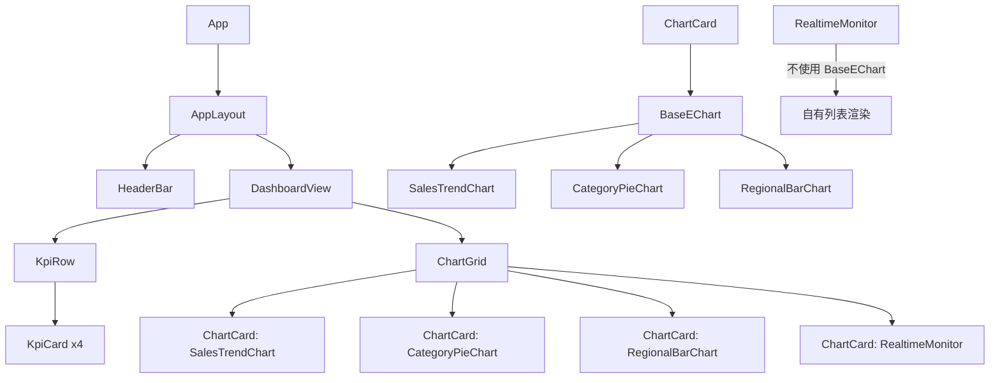

# Prism · 棱镜 — 数据可视化大屏

> 一个帮助初学者从 0 到 1 学习制作数据大屏的开源项目。
> 英文名 Prism，中文名 棱镜 —— 透过数据折射多维洞察。

---

## 一、项目概览

你需要构建一个纯前端数据可视化大屏项目，遵循以下核心约束：

- **纯前端**：无后端服务，所有数据来源于 Mock
- **Mock 优先**：预置完整且真实的模拟数据，大屏打开即有数据展示
- **可切换数据源**：架构上预留从 Mock 切换到真实 API 的能力，切换时组件代码零改动
- **模块化开发**：严格遵循 feature-based 目录结构，不能把所有代码堆在一个文件中
- **质量系统**：内置测试、日志、代码质量工具链
- **最终产出**：一个可直接在浏览器中打开的、视觉美观的数据大屏页面

---

## 二、技术栈

| 分层 | 技术选型 | 版本约束 |
|------|----------|----------|
| 框架 | Vue 3 + Composition API + `<script setup>` + TypeScript | vue ^3.5 |
| 构建 | Vite | ^5.4 |
| 图表 | ECharts | ^5.5 |
| 状态管理 | Pinia | ^2.1 |
| 路由 | Vue Router | ^4.4 |
| HTTP | Axios | ^1.7 |
| Mock | mockjs | ^1.1 |
| 测试 | Vitest + @vue/test-utils + jsdom | latest |
| E2E | Playwright | latest |
| 日志 | 自定义 Logger（分层级、可插拔 transport） | 自实现 |
| 代码质量 | ESLint + Prettier + Husky + lint-staged + commitlint | latest |

---

## 三、目录结构

项目创建时必须严格遵循以下目录结构：

```
prism/
├── index.html
├── package.json
├── vite.config.ts
├── tsconfig.json
├── tsconfig.node.json
├── env.d.ts
├── .env                        # 默认环境变量
├── .env.development            # 开发环境
├── .eslintrc.cjs
├── .prettierrc.json
├── .lintstagedrc.json
├── commitlint.config.cjs
├── .husky/
│   └── pre-commit
├── public/
│   └── favicon.svg
├── src/
│   ├── main.ts                 # 应用入口
│   ├── App.vue                 # 根组件
│   ├── core/                   # 框架无关的核心层
│   │   ├── config/
│   │   │   └── index.ts        # 应用配置（数据源切换等）
│   │   ├── logger/
│   │   │   ├── index.ts        # Logger 入口
│   │   │   ├── types.ts        # 日志类型定义
│   │   │   ├── logger.ts       # Logger 实现
│   │   │   └── transports.ts   # 日志输出通道
│   │   └── error-handler/
│   │       └── index.ts        # 全局错误处理
│   ├── data/                   # 数据访问层
│   │   ├── types/
│   │   │   ├── dashboard.ts    # 大屏数据类型
│   │   │   └── chart.ts        # 图表数据类型
│   │   ├── repository/
│   │   │   ├── DashboardRepository.ts      # 接口定义
│   │   │   ├── impl/
│   │   │   │   ├── MockDashboardRepo.ts    # Mock 实现
│   │   │   │   └── ApiDashboardRepo.ts     # API 实现（占位）
│   │   │   └── index.ts        # 依赖注入工厂
│   │   ├── mock/
│   │   │   ├── index.ts        # Mock 数据入口
│   │   │   ├── dashboard.ts    # 大屏整体 Mock 数据
│   │   │   └── charts/         # 各图表 Mock 数据
│   │   │       ├── sales-trend.ts
│   │   │       ├── category-distribution.ts
│   │   │       ├── realtime-monitor.ts
│   │   │       ├── regional-stats.ts
│   │   │       └── kpi-cards.ts
│   │   └── api/
│   │       ├── client.ts       # Axios 实例
│   │       ├── interceptors.ts # 拦截器
│   │       └── endpoints.ts    # API 端点映射
│   ├── features/               # 业务功能模块
│   │   ├── dashboard/
│   │   │   ├── views/
│   │   │   │   └── DashboardView.vue   # 大屏主页面
│   │   │   ├── components/
│   │   │   │   ├── DashboardHeader.vue # 顶部标题栏
│   │   │   │   ├── KpiCard.vue         # KPI 指标卡片
│   │   │   │   ├── KpiRow.vue          # KPI 指标行
│   │   │   │   └── ChartGrid.vue       # 图表网格布局
│   │   │   └── store.ts       # Dashboard Pinia store
│   │   ├── charts/
│   │   │   ├── components/
│   │   │   │   ├── ChartCard.vue          # 图表容器卡片
│   │   │   │   ├── BaseEChart.vue         # ECharts 基础封装
│   │   │   │   ├── SalesTrendChart.vue    # 销售趋势折线图
│   │   │   │   ├── CategoryPieChart.vue   # 品类分布饼图
│   │   │   │   ├── RegionalBarChart.vue   # 区域柱状图
│   │   │   │   └── RealtimeMonitor.vue    # 实时监控面板
│   │   │   ├── composables/
│   │   │   │   └── useECharts.ts          # ECharts 组合式逻辑
│   │   │   ├── config/
│   │   │   │   ├── sales-trend.ts         # 折线图配置
│   │   │   │   ├── category-pie.ts        # 饼图配置
│   │   │   │   ├── regional-bar.ts        # 柱状图配置
│   │   │   │   └── kpi-cards.ts           # KPI 样式配置
│   │   │   └── types.ts       # 图表组件专属类型
│   │   └── layout/
│   │       ├── components/
│   │       │   ├── AppLayout.vue       # 大屏布局容器
│   │       │   ├── HeaderBar.vue       # 全局顶栏
│   │       │   └── FooterBar.vue       # 底栏（可选）
│   │       └── store.ts       # 布局状态（全屏、主题等）
│   ├── shared/
│   │   ├── components/
│   │   │   ├── LoadingSpinner.vue      # 加载状态
│   │   │   ├── ErrorBoundary.vue       # 错误边界
│   │   │   └── DataPanel.vue           # 数据面板容器
│   │   ├── composables/
│   │   │   ├── useResizeObserver.ts     # 响应式尺寸监听
│   │   │   └── useAutoRefresh.ts        # 定时刷新
│   │   └── utils/
│   │       ├── format.ts      # 数字/日期格式化
│   │       └── helpers.ts     # 通用工具函数
│   └── styles/
│       ├── variables.css      # CSS 变量（主题色、字体等）
│       ├── reset.css          # CSS Reset
│       ├── global.css         # 全局样式
│       └── dashboard-theme.css # 大屏专属主题
├── __tests__/
│   ├── unit/
│   │   ├── core/
│   │   │   └── logger.test.ts
│   │   ├── data/
│   │   │   ├── Repository.test.ts
│   │   │   └── MockData.test.ts
│   │   └── features/
│   │       ├── DashboardView.test.ts
│   │       └── BaseEChart.test.ts
│   └── e2e/
│       ├── dashboard.spec.ts
│       └── playwright.config.ts
└── README.md
```

---

## 四、Mock 数据设计

### 4.1 数据主题

构建一个"智慧零售运营中心"大屏，包含以下数据维度：

- **核心 KPI**：今日销售额、订单量、客单价、转化率
- **销售趋势**：近 24 小时销售额曲线（按小时聚合）
- **品类分布**：各商品品类销售额占比
- **区域对比**：各区域销售额和订单量
- **实时监控**：近 10 分钟的实时订单流

### 4.2 Mock 数据规范

所有 Mock 数据必须通过 mockjs 生成，且数据结构必须可预测（即相同的 seed 产生相同的 mock 数据）。

在 `src/data/mock/dashboard.ts` 中定义主数据结构：

```typescript
export interface KpiData {
  todaySales: number;         // 今日销售额（元）
  todayOrders: number;        // 今日订单数
  avgOrderValue: number;      // 客单价（元）
  conversionRate: number;     // 转化率（%）
  salesGrowth: number;        // 销售同比增长（%）
  ordersGrowth: number;       // 订单同比增长（%）
}

export interface SalesTrendPoint {
  hour: string;               // "00:00" ~ "23:00"
  sales: number;              // 该小时销售额
  orders: number;             // 该小时订单数
}

export interface CategoryItem {
  name: string;               // 品类名
  value: number;              // 销售额（元）
  percentage: number;         // 占比（%）
}

export interface RegionalStats {
  region: string;             // 区域名
  sales: number;              // 销售额
  orders: number;             // 订单量
  growth: number;             // 同比
}

export interface RealtimeOrder {
  id: string;
  product: string;
  amount: number;
  region: string;
  time: string;
  status: 'pending' | 'processing' | 'completed';
}

export interface DashboardData {
  kpi: KpiData;
  salesTrend: SalesTrendPoint[];
  categoryDistribution: CategoryItem[];
  regionalStats: RegionalStats[];
  realtimeOrders: RealtimeOrder[];
  lastUpdated: string;        // ISO datetime
}
```

Mock 数据生成要求：

| 字段 | 生成规则 |
|------|----------|
| 销售额 | 1200000 ~ 1800000 之间的随机整数 |
| 订单数 | 8000 ~ 12000 之间的随机整数 |
| 客单价 | 120 ~ 180 之间的浮点数（保留2位） |
| 转化率 | 2.0 ~ 5.0 之间的浮点数（保留1位） |
| 增长率 | 5 ~ 30 之间的百分数 |
| 销售趋势 | 24 个点，模拟夜市高峰（10-12点、14-16点、19-21点有三个波峰） |
| 品类 | 至少 6 个品类：服装、数码、家电、美妆、食品、家居 |
| 区域 | 至少 6 个区域：华北、华东、华南、华中、西南、西北 |
| 实时订单 | 始终返回 20 条最新记录，按时间倒序 |

---

## 五、组件树与数据流



数据流向：

```
DashboardView.vue
  ├── onMounted → useDashboardStore.fetchData()
  │       ├── repository.getDashboardData()
  │       │       ├── MockDashboardRepo (当 VITE_DATA_SOURCE=mock)
  │       │       └── ApiDashboardRepo   (当 VITE_DATA_SOURCE=api)
  │       └── store.update(data)
  ├── store.kpi        → props → KpiRow → KpiCard
  ├── store.salesTrend → props → ChartCard → SalesTrendChart
  ├── store.category   → props → ChartCard → CategoryPieChart
  ├── store.regional   → props → ChartCard → RegionalBarChart
  └── store.orders     → props → RealtimeMonitor
```

---

## 六、质量系统实现规范

### 6.1 日志系统 (`src/core/logger/`)

```typescript
// 日志等级
enum LogLevel {
  DEBUG = 0,
  INFO = 1,
  WARN = 2,
  ERROR = 3,
}

// Logger 命名空间模式
const logger = new Logger('DashboardStore');
logger.info('数据加载完成', { duration: 120, source: 'mock' });
logger.error('数据加载失败', err);

// 开发环境：console + 格式化输出
// 生产环境：可配置 transport（console 或发送到日志服务）
// debug 日志在生产构建时自动 tree-shake 移除
```

### 6.2 测试系统

- **单元测试**：Vitest，覆盖 Logger、Repository 工厂、Mock 数据生成器、工具函数
- **组件测试**：@vue/test-utils，覆盖 BaseEChart 渲染、KpiCard 数据展示
- **E2E 测试**：Playwright，覆盖页面加载、数据展示、响应式布局
- 测试文件放在 `__tests__/` 下，与 src 目录结构镜像对应

### 6.3 代码质量工具

- ESLint：`@antfu/eslint-config` 或标准 `typescript-eslint` 严格配置
- Prettier：单引号、尾逗号、100 字符宽度
- Husky：pre-commit 钩子运行 lint-staged
- lint-staged：对 `*.ts` `*.vue` 文件运行 eslint --fix + prettier --write
- commitlint：`@commitlint/config-conventional`，强制 conventional commits

---

## 七、大屏设计约束

你必须设计出美观、专业的数据大屏页面，遵循以下约束：

### 7.1 色彩与风格

- **主色调**：深蓝/深灰科技风（#0a1628 ~ #1a2a4a 渐变背景）
- **强调色**：蓝紫色渐变（#3b82f6 → #8b5cf6）用于图表和关键元素
- **辅助色**：青色（#06b6d4）用于次级高亮
- **文字色**：主文字 #e2e8f0，次文字 #94a3b8
- **卡片背景**：半透明深色（rgba(30, 60, 114, 0.4)），带 1px 边框发光效果
- **字体**：系统无衬线字体，数字使用 tabular-nums
- **不使用 emoji 作为图标**：用 lucide 图标库或 SVG 图标

### 7.2 布局

- **全屏 16:9 自适应**：使用 CSS vw/vh + flex/grid 实现
- **顶部标题栏**：居中显示"智慧零售运营中心"，左右放置时间和刷新按钮
- **KPI 指标行**：4 个指标卡片横向排列，每个卡片显示数值 + 标签 + 增长率
- **图表网格**：4 个图表区域 2×2 排列，每个区域包含标题 + 图表主体
- **实时监控面板**：右下角显示实时订单滚动列表，带状态标签和渐变背景

### 7.3 交互效果

- 页面加载时 KPI 数字有滚动计数动画（从 0 增加到目标值）
- 图表卡片悬停时微弱的边框辉光效果
- 实时监控面板每 3 秒滚动更新一条新订单（从顶部插入，底部移除）
- 右上角显示当前时间（每秒更新）

### 7.4 响应式

- 桌面端以 1920×1080 为设计基准
- 屏幕缩小时卡片和字体按比例缩放（使用 clamp() 或视口单位）
- 滚动条自定义暗色风格

### 7.5 视觉禁忌

- 不要在卡片内嵌套卡片
- 不要使用纯 SVG 渐变作为背景
- 不要使用 emoji 或 bokeh 光斑装饰
- 不要使用分段圆形/圆角矩形作为装饰性元素
- 不要出现文字溢出或重叠

---

## 八、执行步骤（AI 按此顺序执行）

### 第 1 步：创建项目脚手架

1. 执行 `npm create vite@latest prism -- --template vue-ts`
2. 进入目录，安装核心依赖：
   ```
   npm install vue-router pinia axios echarts mockjs
   npm install -D @types/mockjs less eslint prettier vitest @vue/test-utils jsdom @antfu/eslint-config husky lint-staged @commitlint/cli @commitlint/config-conventional playwright
   ```
3. 配置 `vite.config.ts`（设置别名 `@/` -> `src/`，配置代理）
4. 配置 `tsconfig.json`（strict 模式，路径别名）
5. 配置环境变量文件 `.env` 和 `.env.development`

### 第 2 步：搭建核心层

1. 创建 `src/core/config/index.ts`：应用配置（数据源、刷新间隔等）
2. 创建 `src/core/logger/`：完整的日志系统（类型、Logger 类、transports）
3. 创建 `src/core/error-handler/`：全局错误捕获

### 第 3 步：搭建数据层

1. 创建 `src/data/types/`：所有领域类型定义
2. 创建 `src/data/mock/`：MockJS 数据生成器（先定义 seed，再生成数据）
3. 创建 `src/data/repository/`：Repository 接口 + Mock 实现 + API 占位实现
4. 创建 `src/data/api/`：Axios 实例 + 拦截器

### 第 4 步：构建基础样式

1. 创建 `src/styles/variables.css`：CSS 变量
2. 创建 `src/styles/reset.css`：CSS Reset
3. 创建 `src/styles/global.css`：全局样式
4. 创建 `src/styles/dashboard-theme.css`：大屏专属主题

### 第 5 步：构建共享组件

1. `LoadingSpinner.vue`
2. `ErrorBoundary.vue`
3. `DataPanel.vue`
4. `useResizeObserver.ts`
5. `useAutoRefresh.ts`
6. 工具函数

### 第 6 步：构建布局模块

1. `AppLayout.vue`：大屏布局容器（padding + 背景）
2. `HeaderBar.vue`：顶栏（标题 + 时间 + 刷新按钮）
3. `FooterBar.vue`：底栏（数据更新时间等）

### 第 7 步：构建 Dashboard Store

1. 在 `src/features/dashboard/store.ts` 中创建 Pinia store
   - state：kpi、salesTrend、categoryDistribution、regionalStats、realtimeOrders、loading、error、lastUpdated
   - getters：计算同比、环比等派生数据
   - actions：fetchData（调用 Repository）、startAutoRefresh、stopAutoRefresh

### 第 8 步：构建图表模块

1. BaseEChart.vue：ECharts 基础封装（resize observer、option 响应式更新、dispose 清理）
2. useECharts.ts：ECharts 组合式逻辑（init、resize、option set、cleanup）
3. 各图表组件的 ECharts option 配置工厂
4. 各图表组件（SalesTrendChart、CategoryPieChart、RegionalBarChart）
5. RealtimeMonitor：实时订单滚动列表（非 ECharts，纯 CSS 动画）

### 第 9 步：构建 Dashboard 页面

1. KpiCard 组件：展示单个指标（图标 + 数值 + 增长率 + 滚动数字动画）
2. KpiRow 组件：4 个 KpiCard 横向排列
3. ChartCard 组件：图表容器卡片（标题 + 图表 + 加载/错误状态）
4. ChartGrid 组件：2×2 图表网格布局
5. DashboardView 组件：组装 KpiRow + ChartGrid

### 第 10 步：组装应用

1. 配置 Vue Router（`/` 指向 DashboardView）
2. 在 App.vue 中挂载 AppLayout + RouterView
3. 在 main.ts 中注册 Router、Pinia
4. 确认 index.html 标题为 "Prism · 棱镜"

### 第 11 步：配置质量工具

1. ESLint 配置文件
2. Prettier 配置文件
3. Husky 初始化 + pre-commit 钩子
4. lint-staged 配置
5. commitlint 配置
6. 基础测试文件（至少一个 Logger 单元测试、一个组件测试）
7. Playwright 配置 + 基础 E2E 测试

### 第 12 步：启动并验证

1. 运行 `npm run dev` 启动开发服务器
2. 确认页面在浏览器中正常渲染
3. 确认所有 Mock 数据显示完整
4. 确认响应式布局正常
5. 确认构建无报错（`npm run build`）
6. 确认测试通过（`npm run test:unit`）

---

## 九、验证清单

- [ ] `npm run dev` 后浏览器自动打开，显示完整的大屏页面
- [ ] 4 个 KPI 卡片显示正确的 mock 数据，数字有滚动动画
- [ ] 折线图展示 24 小时销售趋势，三个波峰可见
- [ ] 饼图展示 6 个品类占比
- [ ] 柱状图展示 6 个区域对比
- [ ] 实时订单列表每 3 秒更新一条
- [ ] 右上角时间每秒更新
- [ ] 数据刷新按钮可用
- [ ] 页面全屏自适应，1920×1080 下布局工整
- [ ] `npm run build` 无报错，产物在 dist/ 目录
- [ ] `npm run test:unit` 测试通过
- [ ] `npm run lint` 通过
- [ ] 切换 VITE_DATA_SOURCE=api 时，程序不报错（虽然 API 不可用）

---

## 十、故障排查指引

如果 AI 在构建过程中遇到问题，按以下顺序排查：

1. **依赖安装失败**：检查 npm 版本，尝试设置 registry 为淘宝镜像
2. **TypeScript 类型错误**：检查 types 目录是否与 mock 数据保持一致
3. **ECharts 不渲染**：确认 DOM 容器有明确宽高，确认 ECharts init 时机在 DOM 挂载后（nextTick）
4. **Mock 数据不变**：mockjs 的 Random 方法在每次调用时生成不同值，如需稳定数据可在模块加载时一次性生成并缓存
5. **Husky 钩子不执行**：初始化后执行 `npx husky`，或在 package.json 中配置 `"prepare": "husky"`
6. **路由懒加载报错**：确认 `@/` 别名在 vite.config.ts 中正确配置，在 tsconfig.json 中包含 paths 映射
